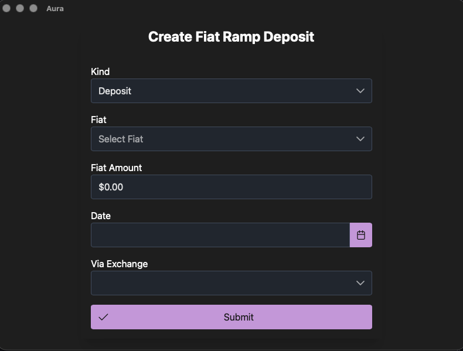
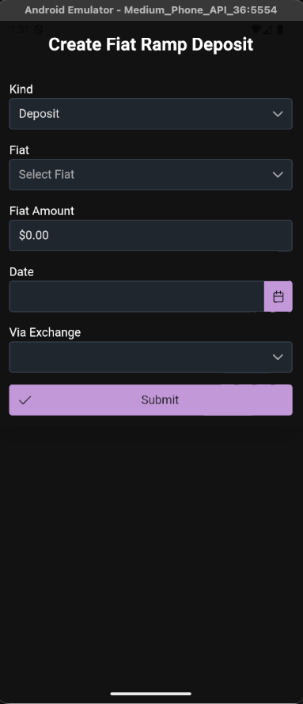
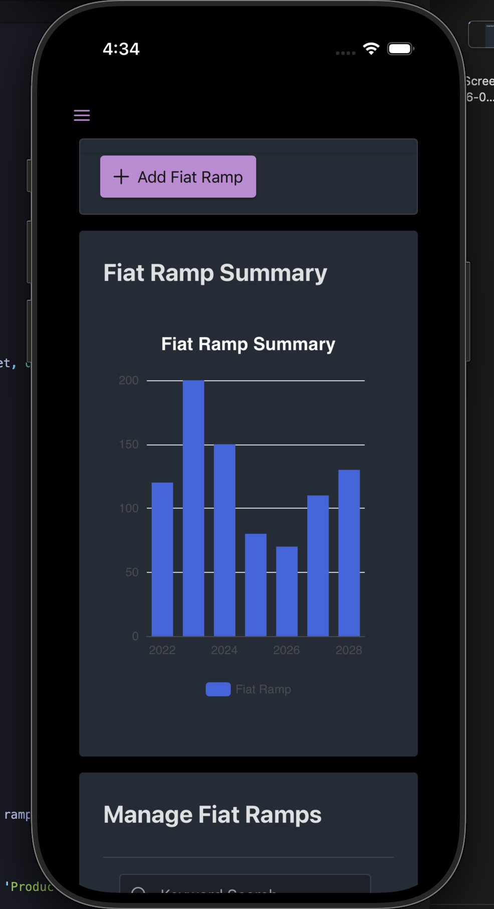

# Aura

Aura is a privacy-focused crypto tracking app built with Tauri, React, and TypeScript.
Still in active development.

## Features

- **Crypto Asset Tracking**: Keep track of your crypto portfolio.
- **Fiat Ramp Tracking**: Manage and track fiat on/off ramp transactions.
- **Cross-Platform**: Developed for Desktop (macOS, Windows, Linux) and Mobile (Android, iOS).
- **Privacy First**: Local database storage.

## Tech Stack

### Frontend
- **Framework**: React 19
- **Build Tool**: Vite
- **Styling**: TailwindCSS v4, PrimeReact
- **Language**: TypeScript
### Backend
- **Core**: Tauri v2 (Rust)
- **Database**: SQLite (via SQLx)

## Prerequisites

- **Node.js**: v20+ recommended
- **Rust**: Stable release
- **Mobile Dev**: Android Studio (Android), Xcode (iOS - macOS only)

## Getting Started

### Installation

Clone the repo and install dependencies:

```bash
pnpm install
```

### Development

**Desktop:**

```bash
pnpm run tauri dev
```

**Android:**

```bash
pnpm run tauri android dev
```

**iOS:**

```bash
pnpm run tauri ios dev
```

|                                     Desktop                                     |                                     Android                                     |                                   iOS                                   |
| :-----------------------------------------------------------------------------: | :-----------------------------------------------------------------------------: | :---------------------------------------------------------------------: |
|  |  |  |

## License

[MIT](LICENSE)
