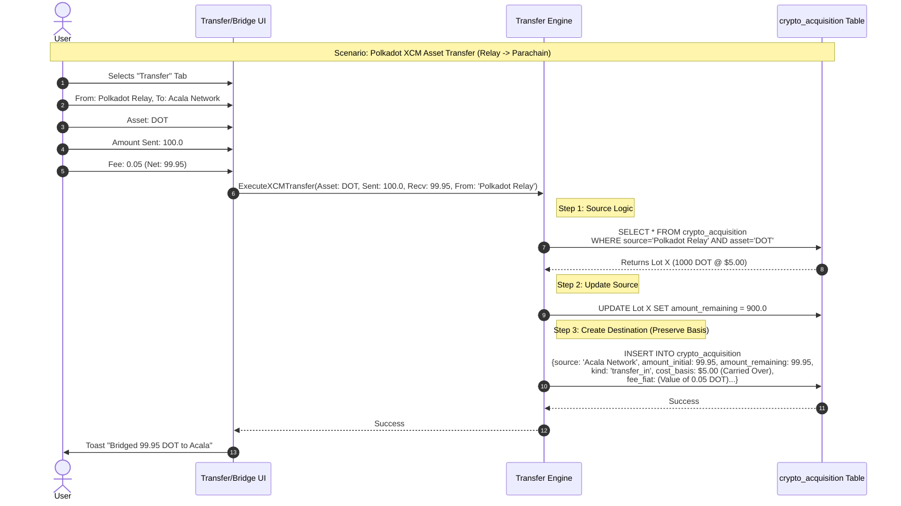

# Aura

```
// Some code
```


```mermaid
sequenceDiagram
    autonumber
    actor User
    participant UI as Transfer/Bridge UI
    participant Handler as Transfer Engine
    participant DB as crypto_acquisition Table

    Note over User, DB: Scenario: Polkadot XCM Asset Transfer (Relay -> Parachain)

    User->>UI: Selects "Transfer" Tab
    User->>UI: From: Polkadot Relay, To: Acala Network
    User->>UI: Asset: DOT
    User->>UI: Amount Sent: 100.0
    User->>UI: Fee: 0.05 (Net: 99.95)
    
    UI->>Handler: ExecuteXCMTransfer(Asset: DOT, Sent: 100.0, Recv: 99.95, From: 'Polkadot Relay')
    
    Note right of Handler: Step 1: Source Logic
    Handler->>DB: SELECT * FROM crypto_acquisition <br/>WHERE source='Polkadot Relay' AND asset='DOT'
    DB-->>Handler: Returns Lot X (1000 DOT @ $5.00)
    
    Note right of Handler: Step 2: Update Source
    Handler->>DB: UPDATE Lot X SET amount_remaining = 900.0
    
    Note right of Handler: Step 3: Create Destination (Preserve Basis)
    Handler->>DB: INSERT INTO crypto_acquisition<br/>{source: 'Acala Network', amount_initial: 99.95, amount_remaining: 99.95,<br/>kind: 'transfer_in', cost_basis: $5.00 (Carried Over),<br/>fee_fiat: (Value of 0.05 DOT)...}
    
    DB-->>Handler: Success
    Handler-->>UI: Success
    
    UI->>User: Toast "Bridged 99.95 DOT to Acala"
```
